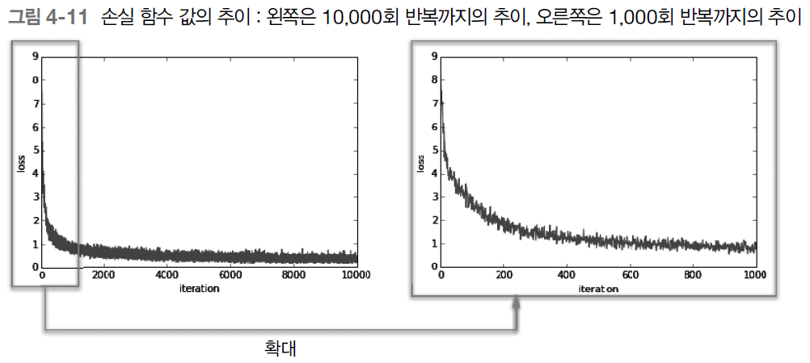
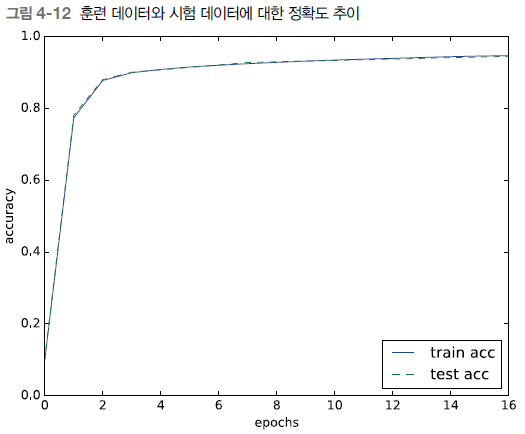

## 수치 미분

수치 미분은 수학에서 말하는 **엄밀한 의미**의 미분과는 달리 소수점 자릿수가 너무 많을 경우 실제 값과의 오차가 발생하는 컴퓨터의 특성에서 기인한다. [참고 링크](https://www.youtube.com/watch?v=-GsrYvZoAdA)

기본적인 개념은 사실 다르지 않다. 다만 변량을 극한값이 아닌 적당히 작은 값(예를 들어 $10^-4$)으로 바꿔서 미분계수를 구한다는 것.

그래서 미분 관련 내용은 이정도로 넘어가도록 한다.

#### 파이썬 구현 ####

```python
def numerical_diff(f, x):
    h = 1e-4
    return (f(x+h) - f(x-h)) / (2*h)
```
굳이 좌우극한의 평균을 내는 이유는 오차를 줄이기 위함이라고 한다.

## 기울기

기울기는 **모든 변수의 편미분을 벡터로 정리한 것**이다. 예를 들어 $f(x_0, x_1) = x_0^2 + x_1^2$라는 함수가 있다면, 이를 편미분하면 다음과 같다.

$$
\frac{\partial f}{\partial x_0} = 2x_0, \quad \frac{\partial f}{\partial x_1} = 2x_1
$$

이를 벡터로 정리하면 다음과 같다.

$$
(\frac{\partial f}{\partial x_0}, \frac{\partial f}{\partial x_1}) = (2x_0, 2x_1)
$$

이처럼 모든 변수의 편미분을 벡터로 정리한 것을 **기울기**라고 한다.

#### 파이썬 구현 ####

```python
def numerical_gradient(f, x):
    h = 1e-4
    grad = np.zeros_like(x)
    
    for idx in range(x.size):
        tmp_val = x[idx]
        
        # f(x+h) 계산
        x[idx] = tmp_val + h
        fxh1 = f(x)
        
        # f(x-h) 계산
        x[idx] = tmp_val - h
        fxh2 = f(x)
        
        grad[idx] = (fxh1 - fxh2) / (2*h)
        x[idx] = tmp_val # 값 복원
        
    return grad
```

예를 들어 $f(x_0, x_1) = x_0^2 + x_1^2$일 때, 그래프를 시각화하면,


앞서 말한 기울기를 시각화해보면 다음과 같다.


결국 기울기가 가리키는 방향은 **각 지점에서 함수의 출력 값을 가장 크게 줄이는 방향**이다. 이 개념은 이어서 **경사 하강법**으로 이어진다.

## 경사 하강법

경사 하강법은 **기울기를 이용해 함수의 최솟값을 찾는 방법**이다. 경사 하강법은 다음과 같은 식으로 나타낼 수 있다.

$$
x_0 = x_0 - \eta \frac{\partial f}{\partial x_0}
$$

이때 $\eta$는 **학습률**이라고 하며, 이는 **하이퍼파라미터**라고 한다. 이는 사용자가 직접 설정해야 하는 값이다.

#### 파이썬 구현 ####

```python
def gradient_descent(f, init_x, lr=0.01, step_num=100):
    x = init_x
    
    for i in range(step_num):
        grad = numerical_gradient(f, x)
        x -= lr * grad
        
    return x
```
step_num을 다 도는 동안 $f(x)$가 최소가 되는 $x$값을 구하고, 만약 step_num을 다 돌기 전에 grad = 0에 도달한다면 더이상의 학습에선 변화가 없다는 의미다.

학습률은 너무 크면 함숫값이 발산하고 너무 작으면 학습이 느려진다. $x^2$의 부호가 양수인 단순한 이차함수를 떠올려보면 쉽게 알수 있다. 이 학습률이 *하이퍼 파라미터*라는 말은 다시 말해 너무 크거나 너무 작은 정도를 기계가 알아서 찾을 수 없고 사람이 지정해줘야한다는 말과 같다.

## 신경망에서의 기울기

경사 하강법은 결국 신경망에서 손실함수를 사용할 수 밖에 없는 이유가 된다. 경사 하강법에 따라 최적의 매개변수 값을 찾기 위해선 결국 미분 가능한 함수를 사용해야하니깐. 그렇다면 신경망에서 기울기란 매개변수, 즉 가중치에 대한 손실함수의 기울기를 의미한다.

책의 예시에 따라 형상이 $2x3$, 즉 2개의 입력과 3개의 출력을 가진 신경망을 가정하자. 이 신경망의 가중치를 $W$, 손실 함수를 $L$라고 하면 기울기는 $\frac{\partial L}{\partial W}$로 나타낼 수 있다.

$$
W = \begin{pmatrix}
w_{11} & w_{21} & w_{31} \\
w_{12} & w_{22} & w_{32}
\end{pmatrix}

\frac{\partial L}{\partial W} = \begin{pmatrix}
\frac{\partial L}{\partial w_{11}} & \frac{\partial L}{\partial w_{21}} & \frac{\partial L}{\partial w_{31}} \\
\frac{\partial L}{\partial w_{12}} & \frac{\partial L}{\partial w_{22}} & \frac{\partial L}{\partial w_{32}}
\end{pmatrix}
$$

#### 파이썬 구현 ####

단일신경망 구현
```python
import numpy as np
from common.functions import softmax, cross_entropy_error
from common.gradient import numerical_gradient

class simpleNet:
    def __init__(self):
        self.W = np.random.randn(2, 3)

    def predict(self, x):
        return np.dot(x, self.W)
    
    def loss(self, x, t):
        z = self.predict(x)
        y = softmax(z)
        loss = cross_entropy_error(y, t)
        
        return loss
```

기울기 구현
```python
net = simpleNet()

def f(W):
    return net.loss(x, t)

dW = numerical_gradient(f, net.W)
print(dW)
# [[ 0.1166753   0.34537207 -0.46204737]
#  [ 0.17501295  0.51805811 -0.69307105]]
```

이에 따라 각 가중치는 양과 음 중 어느 방향으로 증가해야 손실 함수를 줄일 수 있는지 알 수 있다.

## 학습 알고리즘 구현

신경망 학습의 절차는 다음과 같다.

1. 미니배치
2. 기울기 계산
3. 매개변수 갱신
4. 1~3 반복

이번엔 2층 신경망 구조로 구현해보자.

```python
import sys, os
sys.path.append(os.path.join(os.path.dirname(__file__), '..'))  # 부모 디렉터리의 파일을 가져올 수 있도록 설정

from common.functions import *
from common.gradient import numerical_gradient


class TwoLayerNet:

    def __init__(self, input_size, hidden_size, output_size, weight_init_std=0.01):
        # 가중치 초기화
        self.params = {}
        self.params['W1'] = weight_init_std * np.random.randn(input_size, hidden_size)
        self.params['b1'] = np.zeros(hidden_size)
        self.params['W2'] = weight_init_std * np.random.randn(hidden_size, output_size)
        self.params['b2'] = np.zeros(output_size)

    def predict(self, x):
        W1, W2 = self.params['W1'], self.params['W2']
        b1, b2 = self.params['b1'], self.params['b2']
    
        a1 = np.dot(x, W1) + b1
        z1 = sigmoid(a1)
        a2 = np.dot(z1, W2) + b2
        y = softmax(a2)
        
        return y
        
    # x : 입력 데이터, t : 정답 레이블
    def loss(self, x, t):
        y = self.predict(x)
        
        return cross_entropy_error(y, t)
    
    def accuracy(self, x, t):
        y = self.predict(x)
        y = np.argmax(y, axis=1)
        t = np.argmax(t, axis=1)
        
        accuracy = np.sum(y == t) / float(x.shape[0])
        return accuracy
        
    # x : 입력 데이터, t : 정답 레이블
    def numerical_gradient(self, x, t):
        loss_W = lambda W: self.loss(x, t)
        
        grads = {}
        grads['W1'] = numerical_gradient(loss_W, self.params['W1'])
        grads['b1'] = numerical_gradient(loss_W, self.params['b1'])
        grads['W2'] = numerical_gradient(loss_W, self.params['W2'])
        grads['b2'] = numerical_gradient(loss_W, self.params['b2'])
        
        return grads
```

MNIST 데이터셋을 사용해 미니배치 학습을 구현해보자.

```python
import sys, os
sys.path.append(os.path.join(os.path.dirname(__file__), '..'))  # 부모 디렉터리의 파일을 가져올 수 있도록 설정

import numpy as np
import matplotlib.pyplot as plt
from dataset.mnist import load_mnist
from two_layer_net import TwoLayerNet

# 데이터 읽기
(x_train, t_train), (x_test, t_test) = load_mnist(normalize=True, one_hot_label=True)

train_loss_list = []

# 하이퍼파라미터
iters_num = 10000  # 반복 횟수를 적절히 설정한다.
train_size = x_train.shape[0]
batch_size = 100   # 미니배치 크기
learning_rate = 0.1

network = TwoLayerNet(input_size=784, hidden_size=50, output_size=10)

for i in range(iters_num):
    # 미니배치 획득
    batch_mask = np.random.choice(train_size, batch_size)
    x_batch = x_train[batch_mask]
    t_batch = t_train[batch_mask]
    
    # 기울기 계산
    grad = network.numerical_gradient(x_batch, t_batch)
    
    # 매개변수 갱신
    for key in ('W1', 'b1', 'W2', 'b2'):
        network.params[key] -= learning_rate * grad[key]
    
    # 학습 경과 기록
    loss = network.loss(x_batch, t_batch)
    train_loss_list.append(loss)

# 그래프 그리기
x = np.arange(len(train_loss_list))
plt.plot(x, train_loss_list)
plt.xlabel("iteration")
plt.ylabel("loss")
plt.ylim(0, 9)
plt.xlim(0, 10000)
plt.show()
```

그러나 이 구현은 직접 실행하면 결과를 보기까지 시간이 매우 오래 걸린다. 따라서 결과를 책의 이미지로 대체하면 다음과 같다.


## 오버피팅 확인

지금까지의 구현은 훈련 데이터셋(train) 내에서의 학습이었다. 이 학습이 실제로 유효하게 작동하려면 다른 데이터셋에서도 올바르게 작동해야할 터. 학습이 훈련 데이터셋에 너무 치중되어 다른 데이터셋에서는 제대로 작동하지 못하는 상태, 즉 범용성을 잃어버린 상태를 '오버피팅(Overfitting)'이라고 한다.

오버피팅을 확인하려면 위의 구현에 시험 데이터셋(test)과의 비교를 추가해야한다.
```python
import sys, os
sys.path.append(os.path.join(os.path.dirname(__file__), '..'))

import numpy as np
import matplotlib.pyplot as plt
from dataset.mnist import load_mnist
from two_layer_net import TwoLayerNet

# 데이터 읽기
(x_train, t_train), (x_test, t_test) = load_mnist(normalize=True, one_hot_label=True)

network = TwoLayerNet(input_size=784, hidden_size=50, output_size=10)

# 하이퍼파라미터
iters_num = 10000  # 반복 횟수를 적절히 설정한다.
train_size = x_train.shape[0]
batch_size = 100   # 미니배치 크기
learning_rate = 0.1

train_loss_list = []
train_acc_list = []
test_acc_list = []

# 1에폭당 반복 수
iter_per_epoch = max(train_size / batch_size, 1)

for i in range(iters_num):
    # 미니배치 획득
    batch_mask = np.random.choice(train_size, batch_size)
    x_batch = x_train[batch_mask]
    t_batch = t_train[batch_mask]
    
    # 기울기 계산
    #grad = network.numerical_gradient(x_batch, t_batch)
    grad = network.gradient(x_batch, t_batch)
    
    # 매개변수 갱신
    for key in ('W1', 'b1', 'W2', 'b2'):
        network.params[key] -= learning_rate * grad[key]
    
    # 학습 경과 기록
    loss = network.loss(x_batch, t_batch)
    train_loss_list.append(loss)
    
    # 1에폭당 정확도 계산
    if i % iter_per_epoch == 0:
        train_acc = network.accuracy(x_train, t_train)
        test_acc = network.accuracy(x_test, t_test)
        train_acc_list.append(train_acc)
        test_acc_list.append(test_acc)
        print("train acc, test acc | " + str(train_acc) + ", " + str(test_acc))

# 그래프 그리기
x = np.arange(len(train_acc_list))
plt.plot(x, train_acc_list, label='train acc')
plt.plot(x, test_acc_list, label='test acc', linestyle='--')
plt.xlabel("epochs")
plt.ylabel("accuracy")
plt.ylim(0, 1.0)
plt.xlim(0, 16)
plt.legend(loc='lower right')
plt.show()
```

이 역시 책의 이미지를 빌려오면 다음과 같다.



## 정리
1. 기계학습에서 사용하는 데이터셋은 **훈련 데이터**와 **시험 데이터**로 나뉜다.
2. 훈련 데이터로 학습한 모델의 범용 능력을 시험 데이터로 평가한다.
3. 신경망 학습은 손실 함수를 지표로, 손실 함수의 값이 작아지는 방향으로 가중치 매개변수를 갱신한다.
4. 경사 하강법은 손실함수의 기울기를 이용해 함수의 최솟값을 찾는 방법이다.
5. 가중치 매개변수를 갱신할 때는 기울기(경사)를 이용하고, 기울어진 방향(손실 함수 값을 줄이는 방향)으로 가중치의 값을 갱신하는 작업을 반복한다.
6. 아주 작은 값을 주었을 때의 차분으로 미분을 구하는 것을 수치 미분이라고 한다.
    - 수치 미분은 일정 수준 이상의 작은 값은 컴퓨터가 inf처리 해버리기 때문에 사용하는 방법이다. 엄밀한 의미의 미분이랑은 필연적인 오차가 발생할 수 밖에 없다.
7. 기울기는 모든 변수의 편미분을 벡터로 정리한 것이다.
8. 오버피팅은 훈련 데이터셋에만 치중되어 다른 데이터셋에서는 제대로 작동하지 않는 상태를 의미한다.

## 질문
1. 근데 기울기 값은 변수 쌍으로 구성된 벡터인데, 대소관계를 대수적으로 어떻게 비교할 수 있는가?
--> 기울기 벡터와 위치 벡터의 차이를 알아보자.
2. 이번 장은 정리하는데 시간이 꽤 걸렸다. 나는 보통 새로 배우는 내용을 스스로가 이해했는지 확인할 때 항상 현재 시점에서 전체 맥락과의 연결점을 찾으려 한다. 그리고 대개는 이 과정에 막힘이 없을 때 스스로 이해에 성공했다고 판단한다. 그런데 이번엔 무엇을 알고 무엇을 모르는지를 구분하는 것조차 어려웠다. 특히 훈련 데이터 내에서의 학습에서 시험 데이터를 활용한 평가로 넘어갈 때 쯤에도 데이터셋의 구분에 대한 개념을 제대로 이해하지 못했고, x와 t의 의미를 구분할 수 없어서 결국 3장까지 다시 펼쳐보고 왔다. 그래도 이번 장은 꾸역꾸역 정복한 것 같긴 한데, 모래 위에 성을 짓는 느낌을 지울 수가 없다...
